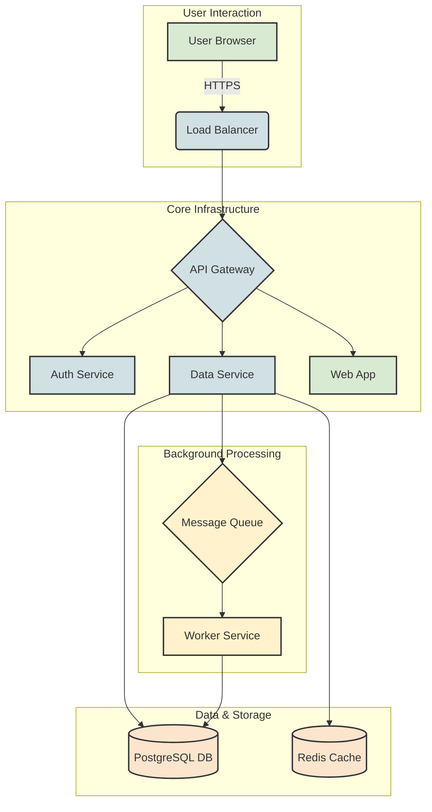

# High-Level Architecture Diagram

**Summary:** This document provides a high-level visual representation of the system architecture. It illustrates the main components and their interactions, offering a bird's-eye view of the platform.

## System Flowchart

The diagram below shows the flow of requests from the user to the various services within our ecosystem.

### Component Descriptions

- **User Browser:** The client-side application that users interact with.
- **Load Balancer:** Distributes incoming traffic across multiple servers to ensure high availability and reliability.
- **API Gateway:** The single entry point for all API requests, handling routing, rate limiting, and authentication.
- **Auth Service:** Manages user authentication and authorization.
- **Data Service:** Core service responsible for business logic and data manipulation.
- **Web App:** Serves the frontend application to the user.
- **PostgreSQL DB:** The primary relational database for persistent storage.
- **Redis Cache:** In-memory cache for frequently accessed data to reduce latency.
- **Message Queue:** A message broker for decoupling services and managing asynchronous tasks.
- **Worker Service:** Processes background jobs from the message queue.

---
*For more granular details, see the [Low-Level Module Descriptions](./low-level/modules.md).*
