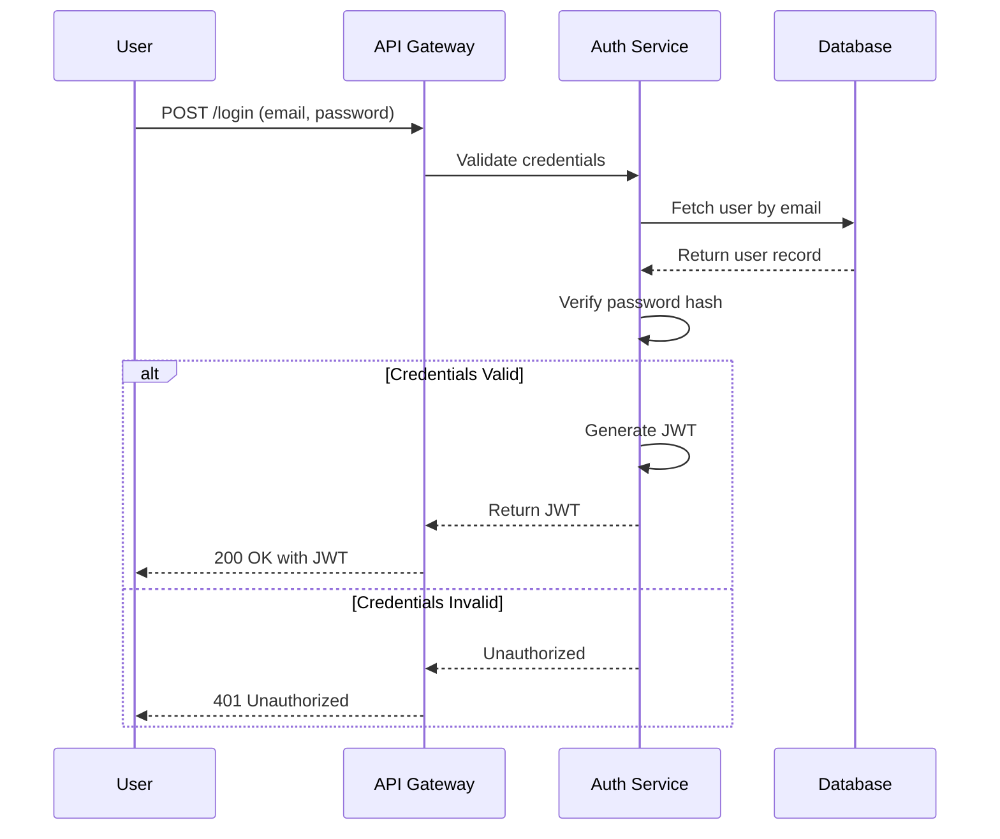
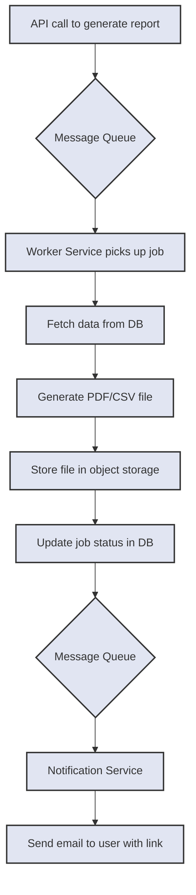

# Low-Level Module Descriptions

**Summary:** This document provides a detailed breakdown of the individual modules and components within our system. It complements the [High-Level Architecture Diagram](./high-level/diagram.md) by offering a more granular view.

## 1. Authentication Service

### 1.1. Responsibilities
- User registration and login.
- JWT generation and validation.
- Password hashing and management.
- Role-based access control (RBAC).

### 1.2. Module Interaction Diagram

## 2. Data Service

### 2.1. Responsibilities
- Exposes CRUD operations for core business entities.
- Enforces business rules and data validation.
- Interacts with the database and cache.
- Publishes events to the message queue for asynchronous processing.

### 2.2. Key Endpoints
- `GET /api/v1/items`: Retrieve a list of items.
- `POST /api/v1/items`: Create a new item.
- `GET /api/v1/items/{id}`: Retrieve a single item by its ID.

## 3. Worker Service

### 3.1. Responsibilities
- Subscribes to topics on the message queue.
- Processes long-running, asynchronous tasks (e.g., report generation, email sending).
- Ensures tasks are idempotent to handle retries safely.

### 3.2. Example Job Flow: Report Generation

---
*For implementation details, refer to the [Code Walkthroughs](../../implementation/code-walkthroughs/README.md).*
