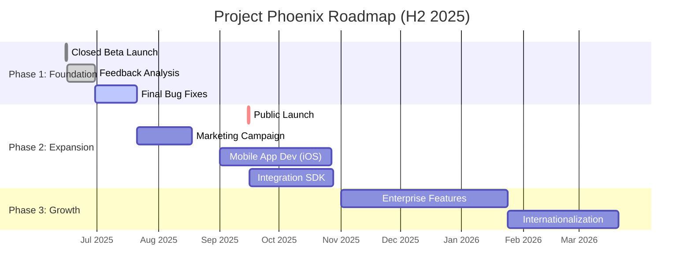

# Project Roadmap & Timeline

**Summary:** This document outlines the high-level roadmap and timeline for Project Phoenix. It serves as a strategic guide for development, marketing, and launch activities.

## Project Phases

Our project is divided into three main phases:
1.  **Phase 1 (Foundation):** Core feature development and beta launch.
2.  **Phase 2 (Expansion):** Public launch, third-party integrations, and mobile app.
3.  **Phase 3 (Growth):** Internationalization, enterprise features, and AI-powered enhancements.

## Gantt Chart Timeline

The following Gantt chart visualizes our projected timeline for the next six months.

## Key Milestones & Deliverables

### Q3 2025
- **[COMPLETED]** **Closed Beta Launch:** June 15, 2025
- **[IN PROGRESS]** **Phase 1 Bug Fixes:** Due August 15, 2025
- **Deliverable:** A stable, production-ready platform.

### Q4 2025
- **Public Launch:** September 15, 2025
  - **Success Metric:** Achieve 10,000 registered users within the first month.
- **Mobile App (iOS) Launch:** November 1, 2025
  - **Success Metric:** 2,000 downloads in the first month.
- **Integration SDK Release:** November 15, 2025
  - **Success Metric:** 10+ partner integrations by end of year.

### Dependencies
- The public launch is dependent on the successful completion of all Phase 1 bug fixes.
- The mobile app development requires the finalization of the public API.

---
*This roadmap is informed by our [Business Overview](../specifications/business/overview.md).*
